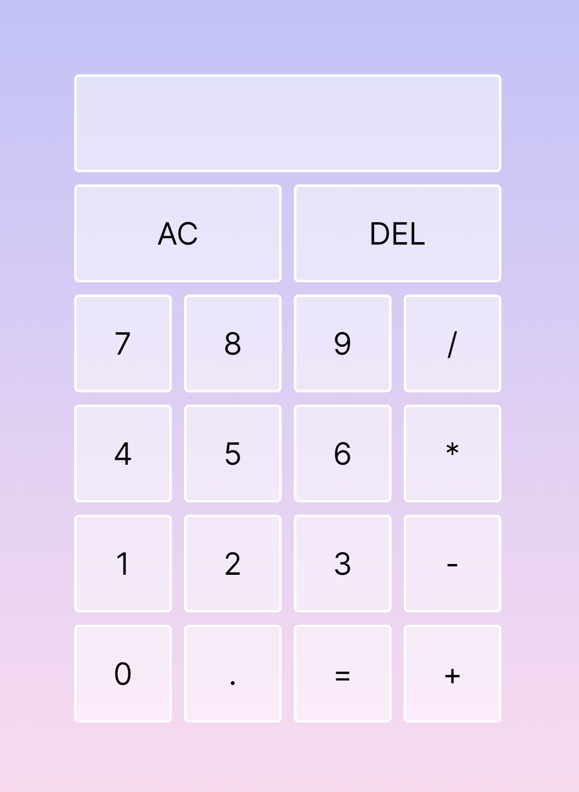

# Simple Calculator

### Description
- This calculator functions like a regular handheld calculator. It has memory and is capable of addition, subtraction, multiplication, and division.
- Inputs and answers are displayed on the screen.
- The "AC" button removes all elements on the screen, while the "DEL" button only removes the last element.



### Tech Used
- HTML
- CSS
- JavaScript

### Lessons Learned
- The ```slice()``` method extracts and returns part of a string. I was able to use ```slice(0, -1)``` to remove the last element on the calculator screen. It was super exciting to witness it working!
- The ```eval()``` function evaluates a string and returns the value. Although I used it in my code, I recognize that it leaves users prone to security issues and is slower than alternatives like ```function()```. For these reasons, I will not be using it in my work going forward.

### Notes
This calculator was my first independent JS project, so it will always hold a special place in my heart. When I finally got it to work, I couldn't help but scream and jump for joy. My dad, who was sitting nearby, was startled by my ruckus - he thought I was in danger. 😂😂